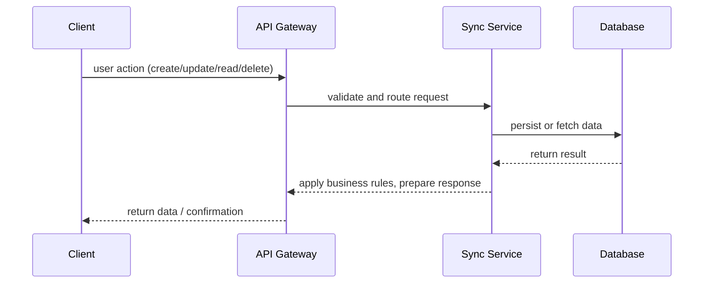

# dotdotdot project plan

## goals
- design and implement a cross‑platform productivity app that empowers users to capture and organise information seamlessly across devices.
- build a robust backend with clear service boundaries to support high scalability and low latency.
- emphasise security, privacy, and offline‑first experiences.

## cross‑platform architecture
The dotdotdot app is envisioned as a layered system with a shared core and platform‑specific user interfaces.

- **Shared core**: implemented in a portable language (e.g. Rust or Kotlin Multiplatform) that encapsulates business logic, data models, encryption, and synchronisation logic. This core is shared across iOS, Android, web, and desktop clients.
- **UI layer**: uses a cross‑platform framework (e.g. Flutter or React Native) to deliver native‑like experiences across mobile platforms and a web front‑end built with React. Desktop clients can be packaged using Electron or Tauri.
- **Backend services**: microservices architecture deployed on a cloud platform. Services include authentication/identity, data storage, synchronisation, real‑time collaboration, notifications, and analytics. Each service is containerised (Docker) and orchestrated via Kubernetes.
- **APIs**: REST/GraphQL endpoints and WebSocket channels provide communication between clients and services. An API gateway handles routing, rate‑limiting, and security (OAuth 2.0 / OpenID Connect).

This layered approach allows independent evolution of each component, ensures code re‑use through the shared core, and supports cross‑platform consistency.

## data flow



1. **Client interaction**: a user interacts with the UI (e.g. creating a note). The shared core translates this action into a structured request.
2. **API gateway**: the request is authenticated and routed to the appropriate microservice (e.g. synchronisation service).
3. **Service processing**: the service applies business logic, updates or retrieves data from the database, and triggers any downstream events (such as notifications).
4. **Synchronisation**: changes are propagated to other devices via real‑time channels (WebSockets or push notifications) ensuring consistency across sessions.
5. **Response**: the processed data is returned through the API gateway back to the client, which updates the UI state.

## starter CI/CD workflow

A basic CI/CD pipeline using GitHub Actions ensures code quality, automatic testing, and deployment:

```yaml
name: ci

on:
  push:
    branches: [ "main" ]
  pull_request:
    branches: [ "*" ]

jobs:
  build:
    runs-on: ubuntu-latest

    steps:
      - uses: actions/checkout@v4

      - name: Set up Node.js
        uses: actions/setup-node@v4
        with:
          node-version: "20"

      - name: Install dependencies
        run: npm install --frozen-lockfile

      - name: Lint
        run: npm run lint

      - name: Run tests
        run: npm test --if-present

      - name: Build
        run: npm run build

      # Optionally build mobile/desktop apps using appropriate toolchains
      # and publish artefacts.

      - name: Build Docker image
        uses: docker/build-push-action@v5
        with:
          push: false
          tags: ghcr.io/${{ github.repository }}:latest

  # Additional jobs can deploy to staging/production environments
```

This workflow installs dependencies, runs linters and tests, builds the project, and constructs a Docker image. Future stages could include security scanning, integration tests, and deployment to Kubernetes or serverless platforms.

## getting started

To contribute:

1. Clone this repository and install dependencies.  
2. Choose a client platform (web, mobile, desktop) and experiment with the shared core.  
3. Review the architecture diagrams and data flow to understand the system.  
4. Check the `milestones.md` file for upcoming tasks and contribute via pull requests.  

We welcome contributions that improve architecture, performance, features, or documentation.
